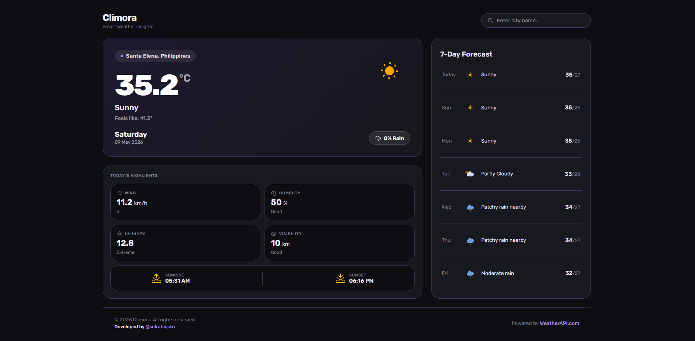

# Climora
Climora is a basic weather application built with Vue.js.
The project was created to practice and apply fundamental Vue.js concepts through a simple and responsive weather interface.

## Overview

The application allows users to search for a city and display current weather information such as:

- Temperature
- Weather condition
- Humidity
- Wind status
- UV index
- Visibility
- Sunrise and sunset time

## Purpose

This project focuses on applying beginner-level Vue.js skills including:

- Component-based architecture
- Props and reusable components
- Conditional rendering using `v-if`
- Reactive data handling
- `script setup`
- Basic project structure organization
- API data rendering
- Responsive UI styling

## Features

- Search weather by city
- Display current weather details
- Weather highlight cards
- Dynamic weather icons
- Responsive layout
- Modern card-based interface

## Tech Stack

- Vue.js
- Vite
- JavaScript
- CSS

## API & Assets

- Powered by WeatherAPI
- Weather icons from AmCharts Free Animated SVG Weather Icons

## Notes

Climora is a practice project intended for learning Vue.js fundamentals and improving frontend development skills through hands-on project building.

## Credits

- Weather Data API: https://www.weatherapi.com/
- Weather Icons: https://www.amcharts.com/free-animated-svg-weather-icons/
